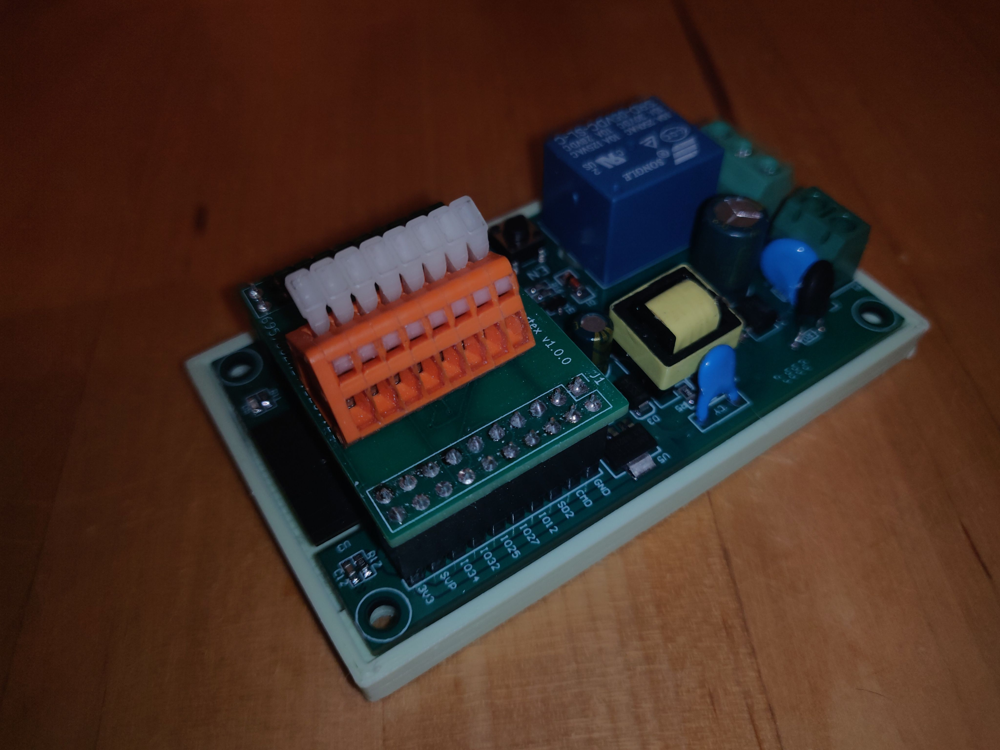
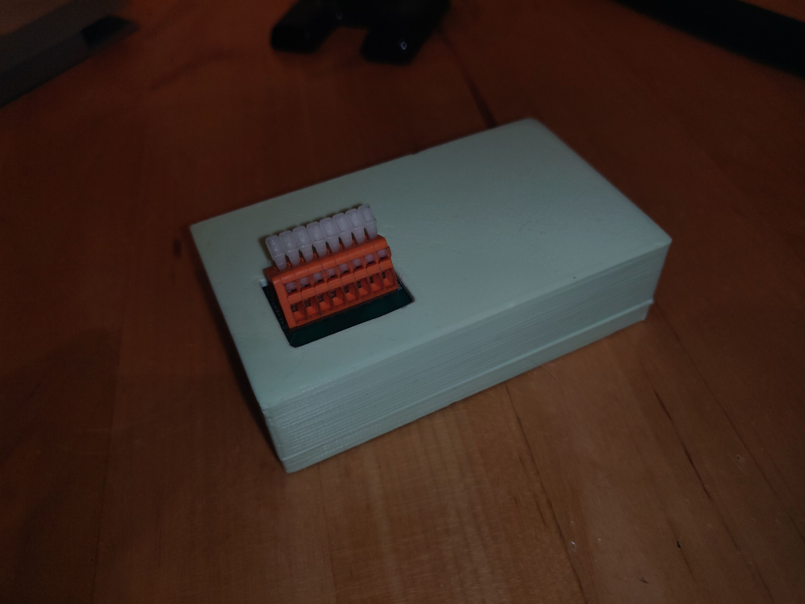

# ESP32 Daughter Board

This is intended for an ESP32 board with an onboard AC/DC power supply
and a relais for that can be used to power the coffee machine itself.

[Example offering on Aliexpress](https://www.aliexpress.us/item/3256805662668563.html) for the main board.

## Required Parts

* 1 x Mainboard
* 1 x WAGO 233-506 Terminal Block
* 1 x MAX31855 temperature sensor
* 1 x K-Type Thermocouple
* 1 x 100nF capacitor (see MAX31855 datasheet)

## Images

